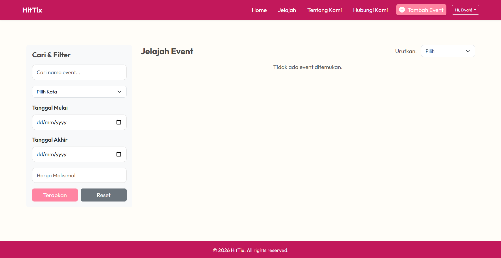
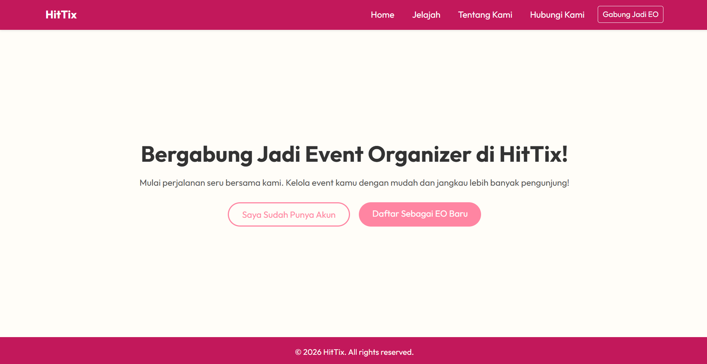
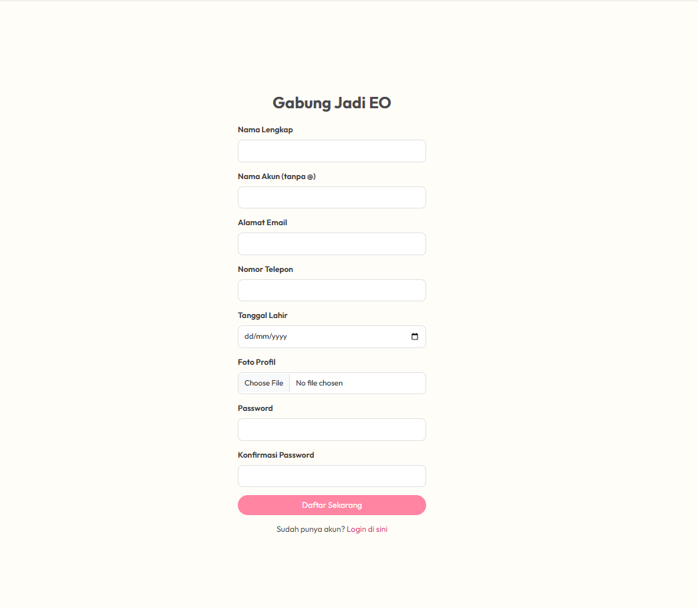
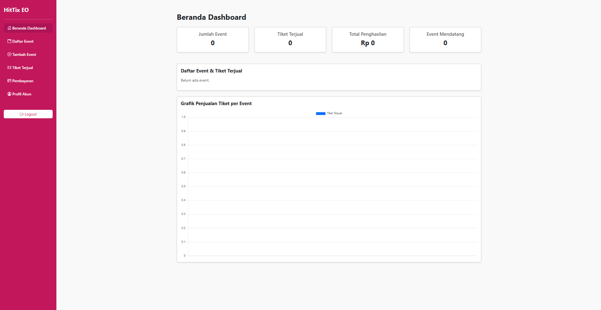
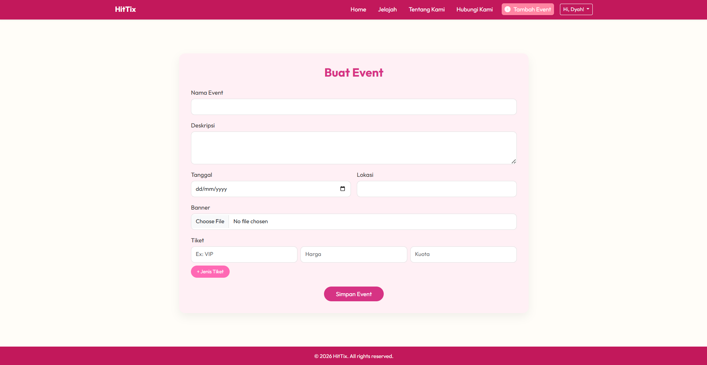
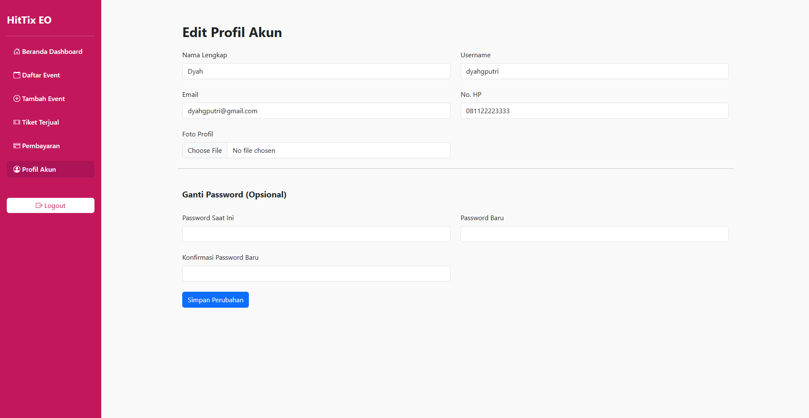
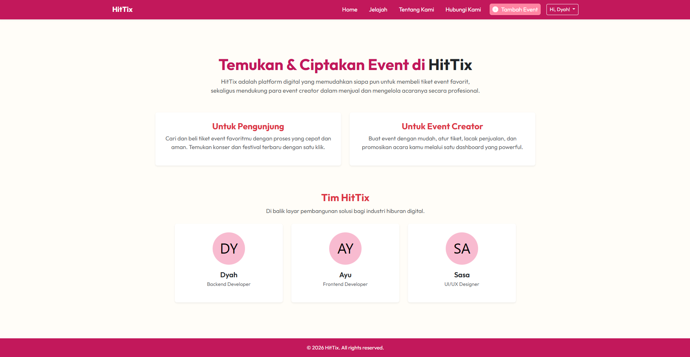
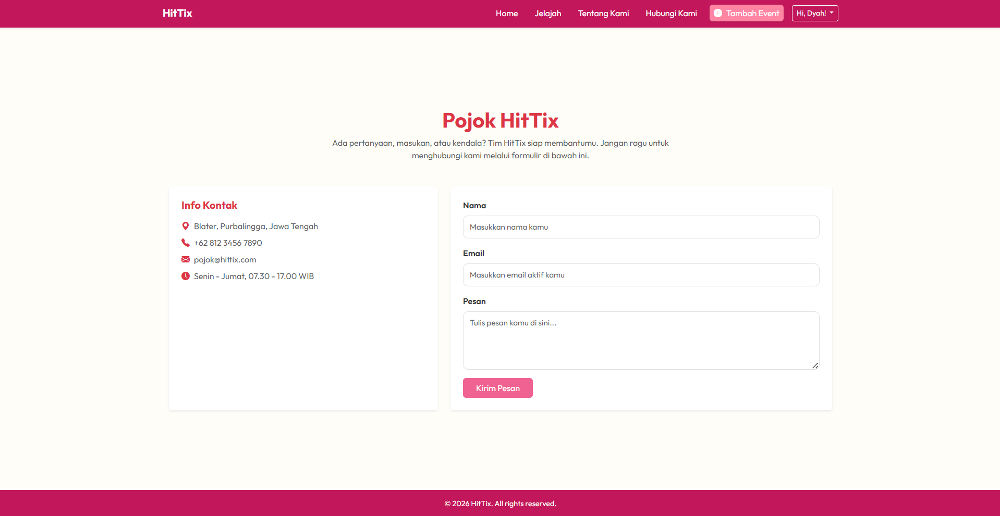

# HitTix Web

HitTix Web adalah aplikasi manajemen event dan penjualan tiket konser berbasis web yang memungkinkan Event Organizer (EO) mengelola event serta memudahkan pengguna dalam melihat informasi dan melakukan pemesanan tiket.

## Overview

Aplikasi ini dikembangkan untuk membantu proses pengelolaan event, mulai dari publikasi acara, pengelolaan data event, hingga pemesanan tiket dalam satu platform.

## Features

- Registrasi dan login pengguna
- Registrasi dan login Event Organizer (EO)
- Dashboard Event Organizer
- Manajemen event (CRUD)
- Manajemen venue
- Manajemen artis
- Manajemen kategori event
- Upload gambar event
- Pemesanan tiket
- Landing page event

## Tech Stack

- PHP
- Laravel
- MySQL
- Blade
- Bootstrap
- JavaScript
- HTML
- CSS
- Git
- Laragon

## Screenshots

### Homepage


### Explore Events


### Join as Event Organizer


### User Registration


### Event Organizer Dashboard


### Create Event


### Edit Profile


### About Page


### Contact Page


## Installation

```bash
git clone https://github.com/odynamic/HitTix-Web.git

cd HitTix-Web

composer install

cp .env.example .env

php artisan key:generate

php artisan migrate --seed

php artisan storage:link

php artisan serve
```

## Author

Developed as a Web Programming project using Laravel Framework.
